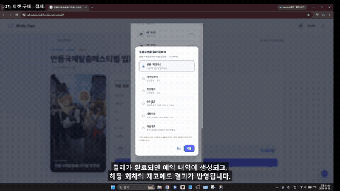
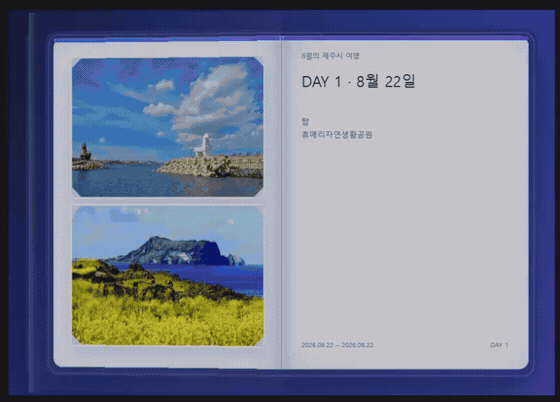
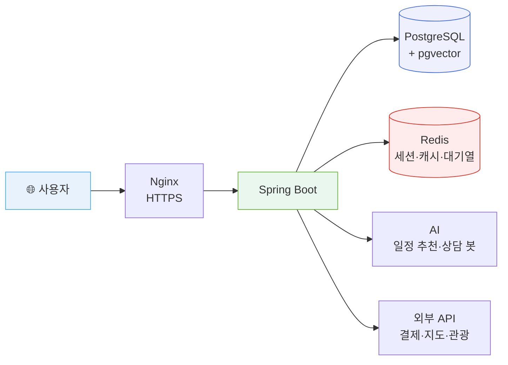

<div align="center">

**여행 계획을 세우고, 티켓을 예약하고, 결제하고, 현장에서 QR로 입장까지.**<br />
중간에 다른 서비스로 넘어가지 않습니다.

<br />

[](https://www.allmytrip.click)
<!--
  영상을 올린 뒤 아래 주석을 풀고 주소를 채웁니다. 주소가 빈 채로 두면 눌렀을 때
  아무 데도 가지 않아 미완성으로 보입니다.

[](영상-주소)
-->
[](https://github.com/heopath/TravelGuide-Project-Team1/wiki)
[](https://heopath.github.io/TravelGuide-Project-Team1/video/technical-slides.html)


</div>

---

<!--
  시연 영상과 화면 GIF. 준비되면 이 주석을 풀어 아래 `🔑 둘러보기` 위에 둡니다.

  ─ 영상을 올린 뒤

  GitHub README에는 YouTube 플레이어가 박히지 않습니다. 썸네일 이미지에 링크를 거는 것이
  유일한 방법입니다. 아래 VIDEO_ID 두 자리를 실제 값으로 바꾸면 됩니다.

  챕터 목록을 함께 두는 이유는, 보는 사람이 12분을 다 볼지 결정하기 전에 무엇이 들어
  있는지 알 수 있어서입니다. 각 줄의 `&t=` 초를 실제 시각으로 맞추면 눌러서 바로 갑니다.
  챕터 구성은 위키의 [기능별 챕터 영상 촬영 계획]을 보세요.

  ─ GIF

  docs/video/gif/ 에 파일을 넣어야 표시됩니다. 없는 채로 주석을 풀면 깨진 이미지가
  보입니다. 만드는 방법은 그 폴더의 README에 있습니다.

  영상과 GIF는 역할이 다릅니다. GIF는 스크롤하다 눈에 걸리는 것이고, 영상은 마음먹고
  보는 것입니다. 둘 다 두는 편이 낫습니다.

## 🎬 이렇게 동작합니다

<div align="center">

[](https://www.youtube.com/watch?v=VIDEO_ID)

**기능 시연 영상 (12분)** — 눌러서 봅니다

</div>

| 시각 | 챕터 | 시각 | 챕터 |
|---:|---|---:|---|
| [00:00](https://www.youtube.com/watch?v=VIDEO_ID&t=0s) | 여는 장 | [06:30](https://www.youtube.com/watch?v=VIDEO_ID&t=390s) | 입장 QR·현장 검표 |
| [01:10](https://www.youtube.com/watch?v=VIDEO_ID&t=70s) | 여행 계획 만들기 | [07:20](https://www.youtube.com/watch?v=VIDEO_ID&t=440s) | 여행 기록·책 지면 |
| [03:10](https://www.youtube.com/watch?v=VIDEO_ID&t=190s) | 일정 편집·경로 최적화 | [08:50](https://www.youtube.com/watch?v=VIDEO_ID&t=530s) | 관리자 운영 |
| [04:00](https://www.youtube.com/watch?v=VIDEO_ID&t=240s) | 항공·숙소 예약 | [10:00](https://www.youtube.com/watch?v=VIDEO_ID&t=600s) | API 키 관리 |
| [04:50](https://www.youtube.com/watch?v=VIDEO_ID&t=290s) | 티켓 예매·대기열 | [10:40](https://www.youtube.com/watch?v=VIDEO_ID&t=640s) | 기술 판단과 검증 |

<div align="center">

| 예약부터 현장 입장까지 | 여행 기록을 책 지면으로 |
|:---:|:---:|
|  |  |
| 예약 → 결제 → 티켓 발급 → 알림 → QR 검표 | 사진 개수에 따라 지면 배치가 바뀝니다 |

</div>

---
-->

## 🔑 둘러보기

**[www.allmytrip.click](https://www.allmytrip.click)** 에서 바로 써볼 수 있습니다. 아래 계정으로 로그인하세요.

<div align="center">

| 이메일 | 비밀번호 |
|---|---|
| `demo@allmytrip.click` | `AllMyTrips2026!` |

</div>

이 계정은 **둘러보라고 공개해 둔 것**이라 비밀번호를 가리지 않았습니다. 대신 일반 사용자 권한만 있고, 다른 사람이 만든 여행이나 예약은 보이지 않습니다.

**관리자 화면은 이 계정으로 열리지 않습니다.** `/admin` 앞에 Cloudflare Access가 한 단계 더 있고, 통과하더라도 관리자 권한이 따로 필요합니다. 엣지와 애플리케이션 권한을 나눠 둔 구조라, 계정 하나가 새어도 운영 화면까지 열리지 않습니다.

> 처음이라면 **여행 계획 만들기 → 예약하러 가기 → 티켓 예매**를 순서대로 눌러보세요. 계획에 넣은 목적지와 날짜가 예약 화면으로 그대로 이어집니다.

---

## ✨ 만든 것

| | 기능 | 설명 |
|:---:|---|---|
| 🗓️ | **여행 일정 만들기** | 목적지·기간을 고르면 DAY별 일정을 짜고 장소를 담습니다 |
| 🤖 | **AI 일정 추천** | 취향과 일정을 보고 다음에 갈 곳을 제안합니다 |
| 🎫 | **티켓 예약·결제** | 대기열을 거쳐 예약하고 결제하면 QR 티켓이 발급됩니다 |
| 📱 | **현장 검표** | 관리자가 QR을 찍어 입장을 확인합니다 |
| 📖 | **여행 기록** | 다녀온 뒤 사진과 글을 남기고 책 지면 이미지로 뽑습니다 |
| 💬 | **실시간 상담** | 봇이 먼저 받고, 필요하면 상담원이 이어받습니다 |
| ⚙️ | **관리자 운영** | 신고·문의·회원·재고·검표 이력을 한 곳에서 처리합니다 |
| 🔑 | **외부 API 키 교체** | 사용량 한도에 걸리면 재배포 없이 화면에서 키를 바꿉니다 |

---

## 🔧 기술적으로 풀어낸 것

<table>
<tr>
<td width="50%" valign="top">

### 재고를 정확히 지키기

인기 티켓은 같은 회차에 동시에 몰립니다. **재고를 확인하고 빼는 두 동작이 갈라지면** 그 사이에 다른 요청이 끼어들어 한 자리를 두 사람에게 팔게 됩니다.

Redis Lua 스크립트로 **한 덩어리로 실행**해 틈을 없앴습니다. k6 부하 테스트로 확인했습니다.

`RedisBookingQueueStore` · `load-test/booking-queue.js`

</td>
<td width="50%" valign="top">

### 입장 코드 재사용 막기

QR을 캡처해 남에게 넘기면 검표가 무의미해집니다.

서버는 **SHA-256 해시만 저장**합니다. 원문은 발급 응답에만 실려 나가고 DB에 남지 않습니다. 유효기간이 지나거나 다시 발급하면 앞선 코드는 즉시 무효가 되고, 검표할 때 티켓 행을 잠그고 한 번만 사용 처리해 **같은 코드로 두 번 들어갈 수 없습니다.**

`TicketValidationService` · `V21__issued_ticket_qr_token.sql`

> 결제 QR은 다른 구현입니다. 5분만 사는 값이라 저장하지 않고 **HMAC-SHA256 서명**만 붙입니다. (`PaymentQrSigner`)

</td>
</tr>
<tr>
<td width="50%" valign="top">

### 사진 개수를 모른 채 지면 짜기

자리를 좌표로 박아두면 3장일 때와 7장일 때 같은 지면이 나옵니다.

**장수와 사진 비율을 보고 배치를 고르게** 만들었습니다. 첫 글자를 크게 놓고 본문이 그 옆을 감싸 흐르는 조판도 직접 구현했습니다.

`record-book.js`

</td>
<td width="50%" valign="top">

### 사진 한 장 때문에 저장이 막히던 것

다른 도메인 사진을 canvas에 그리면 브라우저가 **이미지 내보내기를 통째로 막습니다.**

허락받은 사진만 그리고 실패한 자리는 비워, 한 장 때문에 지면 전체를 잃지 않게 했습니다.

</td>
</tr>
<tr>
<td width="50%" valign="top">

### 재배포 없이 API 키 갈아끼우기

키를 `@Value`로 받으면 앱이 뜰 때 한 번 정해지고 끝입니다. **사용량 한도에 걸려 급히 바꿔야 하는 그 순간에** 재배포 없이는 안 바뀝니다.

호출할 때마다 꺼내 쓰도록 바꾸고, DB에는 **AES-256-GCM으로 암호화**해 넣습니다. 마스터 키는 DB가 아니라 환경변수에 둬서 덤프만으로는 못 읽습니다. 저장 전에 서버가 실제로 연결해 보고, 통과한 키만 저장합니다.

`ApiKeyProvider` · `ApiKeyCipher`

</td>
<td width="50%" valign="top">

### 악용 요청은 엣지에서 걸러내기

로그인·회원가입과 비용이 큰 AI API는 서버까지 오기 전에 막는 편이 낫습니다.

Cloudflare에서 **IP별 요청 횟수를 제한**하고, 사람 확인 토큰은 화면에 위젯만 붙이지 않고 **서버가 Cloudflare에 다시 검증**합니다. 관리자 경로는 엣지 인증을 한 단계 더 두어, 통과해도 관리자 권한이 없으면 아무것도 못 합니다.

정적 파일만 Edge에 캐시하고 HTML·API는 제외했습니다.

</td>
</tr>
</table>

---

## 🏗️ 구조



Redis는 캐시만이 아니라 **세션 저장소**와 **예약 대기열**로도 씁니다. 세션을 Redis에 두어 배포해도 로그인이 풀리지 않고, 서버를 늘려도 유지됩니다.

---

## 📊 규모

<div align="center">

| DB 마이그레이션 | 서버 테스트 | 화면 테스트 | 화면 |
|:---:|:---:|:---:|:---:|
| **35** | **750개** | **40개 파일** | **26** |

</div>

밀어 넣을 때마다 GitHub Actions가 **빌드 · 테스트 · CodeQL 보안 검사**를 돌리고, 통과하면 EC2에 자동 배포됩니다.

---

## 🚀 실행해보기

```bash
git clone https://github.com/heopath/TravelGuide-Project-Team1.git
cd TravelGuide-Project-Team1

docker compose up -d          # PostgreSQL + Redis
./gradlew bootRun --args='--spring.profiles.active=local'
```

http://localhost:8080 으로 접속합니다. 자세한 준비 과정은 [실행 시나리오](https://github.com/heopath/TravelGuide-Project-Team1/wiki/프로젝트-실행-시나리오)를 보세요.

로그인해서 볼 계정이 필요하면 위 `🔑 둘러보기`의 체험 계정을 로컬에도 만들 수 있습니다.

```bash
docker compose exec -T postgres psql -U allmytrips -d all_my_trips \
  -f - < database/seed/demo_account.sql
```

> 지도·결제·AI 기능은 외부 API 키가 필요합니다. 키 없이도 앱은 뜨고, 해당 기능은 안내 문구가 나옵니다.

---

## 🛠️ 기술 스택

<div align="center">

**Backend**<br />


**Frontend**<br />


**Data · Infra**<br />


</div>

---

## 👥 팀

<div align="center">

| 👑 팀장 | 팀원 | 팀원 | 팀원 | 팀원 |
|:---:|:---:|:---:|:---:|:---:|
| **허민재** | 정인길 | 홍유원 | 남현호 | 한성주 |

</div>

---

## 📚 더 보기

<details>
<summary><b>📖 프로젝트 소개와 기획</b></summary>

<br />


<br>

## 📝 프로젝트 개요

여행을 준비할 때 사용자는 관광지, 맛집, 숙박, 날씨, 교통 등
여러 정보를 각각 다른 서비스에서 찾아야 합니다.

All My Trips은 이러한 여행 준비 과정을 하나의 서비스로 통합하고,
사용자가 몇 가지 조건만 입력하면 AI가 맞춤형 여행 계획을 제안하도록 설계합니다.

AI가 만든 일정은 사용자가 자유롭게 수정할 수 있으며,
향후 실시간 정보와 예약 기능까지 연동하여 실제 여행 준비 과정 전체를 관리할 수 있도록 확장합니다.

---

## 🎯 프로젝트 핵심 목표

* AI 기반 맞춤형 여행 일정 생성
* 사용자 직접 여행 일정 편집
* 여행지 및 관광 정보 탐색
* 실시간 날씨와 지도 정보 제공
* 여행 일정 저장 및 관리
* 예약 시스템과 대기열 기능 구현
* 대규모 트래픽 및 동시성 문제 해결
* RAG 기반 개인화 AI 여행 가이드 구현

---

## 💡 Service Concept

```text
"어디로 갈까?"
      ↓
"무엇을 할까?"
      ↓
"어떤 일정으로 움직일까?"
      ↓
"어디에서 머물까?"
      ↓
"내 취향에 맞게 수정"
      ↓
"나만의 여행 계획 완성"
```

> All My Trips은 여행 계획의 시작부터 실제 여행 준비까지
> 하나의 서비스 안에서 해결하는 것을 목표로 합니다.


---


<br>

## 🤖 AI 여행 일정 추천

사용자가 입력한 여행 조건을 기반으로 AI가 맞춤형 여행 일정을 생성합니다.

### 입력 조건

* 📍 여행 지역
* 📅 여행 기간
* 👥 동행자
* 🎯 여행 목적
* ❤️ 여행 스타일
* 💰 예상 예산

### 예시

```text
여행 지역 : 제주도
여행 기간 : 3박 4일
동행자 : 친구
여행 스타일 : 맛집 + 관광
예산 : 1인 50만원
```

### AI 추천 결과

```text
DAY 1
제주공항
→ 동문시장
→ 용두암
→ 숙소 체크인

DAY 2
성산일출봉
→ 섭지코지
→ 우도

DAY 3
협재해수욕장
→ 오설록
→ 애월 카페거리

DAY 4
기념품 쇼핑
→ 제주공항
```

---

## 🗓️ 여행 일정 직접 편집

AI가 만든 일정을 그대로 사용하는 것이 아니라
사용자가 직접 여행 계획을 수정하고 완성할 수 있습니다.

* 일정 추가 / 삭제
* 장소 순서 변경
* 관광지 추가
* 맛집 추가
* 숙소 추가
* 메모 작성
* 일정 저장

---

## 📍 여행 장소 탐색

다양한 여행 정보를 검색하고 일정에 바로 추가할 수 있습니다.

* 관광지
* 맛집
* 카페
* 숙박
* 축제
* 체험 활동

---

## ⭐ 즐겨찾기

관심 있는 장소를 저장해두고
추후 여행 일정에 간편하게 추가할 수 있습니다.

---

## 🌤️ 실시간 여행 정보

외부 API를 활용하여 여행에 필요한 실시간 정보를 제공합니다.

* 현재 날씨
* 여행 기간 날씨 예보
* 관광 정보
* 지도 및 위치 정보
* 교통 정보

---

## 👤 회원 기능

* 회원가입
* 로그인
* 로그아웃
* 마이페이지
* 내 여행 일정 조회
* 즐겨찾기 관리


---


<br>

## User Flow

```text
사용자 접속
      ↓
여행 조건 입력
      ↓
AI 여행 일정 생성
      ↓
일정 수정 및 저장
      ↓
날씨 / 지도 / 관광 정보 확인
      ↓
숙박 / 교통 / 티켓 조회
      ↓
여행 일정 최종 확정
```

---

## Main Page Concept

All My Trips의 첫 화면은
Google 검색 페이지처럼 복잡하지 않고 직관적인 UI를 목표로 합니다.

사용자가 사이트에 접속한 후 별도의 복잡한 탐색 없이
바로 여행 조건을 입력하고 AI 여행 계획을 생성할 수 있도록 구성합니다.

```text
              ✈️ All My Trips

       어디로 여행을 떠나시나요?

           [ 여행 지역 입력 ]

       얼마 동안 여행하시나요?

           [ 여행 기간 선택 ]

       누구와 함께 가시나요?

 [ 혼자 ] [ 친구 ] [ 연인 ] [ 가족 ]

       어떤 여행을 원하시나요?

 [ 관광 ] [ 맛집 ] [ 힐링 ] [ 액티비티 ]

         [ ✨ AI 여행 계획 만들기 ]
```

### 추가 설정

기본 화면을 복잡하게 만들지 않기 위해
필요한 사용자만 추가 옵션을 펼쳐 설정할 수 있도록 구성합니다.

* 예상 예산
* 이동 수단
* 선호 음식
* 여행 강도
* 숙박 스타일
* 관심 여행 테마


</details>

<details>
<summary><b>🗺️ 구현 단계와 로드맵</b></summary>

<br />

## 🚀 Development Roadmap

| Phase | 목표               | 핵심 기능                           |
| :---: | ---------------- | ------------------------------- |
|  `1차` | 🤖 AI 여행 플래너 MVP | AI 일정 생성, 일정 관리, 즐겨찾기           |
|  `2차` | ⚡ 실서비스 기능 확장     | 실시간 API, 예약, Redis, 대기열, 부하 테스트 |
|  `3차` | 🧠 AI 개인화 고도화    | RAG, Vector DB, 일정 분석, 동선 최적화   |

---

### 1차 — MVP


<br>

## AI 여행 가이드 & 여행 일정 관리

All My Trips의 핵심 서비스를 먼저 구현하는 단계입니다.

### 주요 기능

* 메인 화면
* AI 여행 일정 생성
* 일정 생성 / 조회 / 수정 / 삭제
* 사용자 직접 일정 작성
* 여행지 탐색
* 즐겨찾기
* 회원 기능
* 마이페이지

### 핵심 목표

> **AI가 추천하고, 사용자가 직접 완성하는 여행 플래너**

1차 구현에서는 All My Trips 서비스의 핵심 가치인
**AI 추천 + 사용자 일정 관리** 기능을 완성하는 것을 목표로 합니다.


### 2차 — 서비스 확장


<br>

## 실시간 여행 정보 & 예약 시스템

1차 구현에서 만든 여행 일정 서비스를
실제 여행 서비스에 가까운 형태로 확장합니다.

### 🌤️ 실시간 API

* 날씨 API
* 지도 API
* 관광 정보 API
* 위치 기반 검색
* 교통 정보 API

---

### 🏨 숙박 및 교통 정보

* 지역별 숙소 검색
* 숙소 상세 정보
* 숙소 위치 확인
* 항공편 정보
* 기차 / 버스 정보
* 이동 경로 확인

---

### 🎫 관광지 티켓 예약

관광지, 축제, 체험 상품 등의 티켓을 예약할 수 있는 기능을 구현합니다.

```text
제주 아쿠아플라넷

예약 가능 수량 : 100

[ 예약하기 ]
```

---

## ⚡ 대규모 트래픽 테스트

한정 수량의 티켓에 많은 사용자가 동시에 접근하는 상황을 구현합니다.

```text
한정 수량 관광 티켓

티켓 수량 : 100개
동시 요청 사용자 : 10,000명
```

### 해결하고자 하는 문제

* 동시 예약 요청
* 중복 예약
* 재고 초과 판매
* DB Lock 문제
* 서버 과부하

---

## 🔒 동시성 제어

검토 기술

```text
Redis
Distributed Lock
Optimistic Lock
Pessimistic Lock
```

---

## 🚦 대기열 시스템

대규모 사용자가 동시에 예약 페이지에 접근하는 경우
서버 부하를 줄이기 위한 대기열 시스템을 구현합니다.

```text
현재 접속자가 많습니다.

현재 대기 순번
324명

예상 대기 시간
약 2분
```

검토 기술

```text
Redis
Queue
Kafka
WebSocket
SSE
```

---

## 📊 부하 테스트

검토 도구

```text
JMeter
k6
nGrinder
```

### 핵심 목표

> **실제 서비스 환경에서 발생할 수 있는 트래픽과 동시성 문제를 직접 재현하고 해결**


### 3차 — AI 고도화


<br>

## RAG 기반 AI 여행 가이드

AI 기능을 단순한 LLM 응답에서
실제 여행 데이터를 기반으로 답변할 수 있는 구조로 발전시킵니다.

---

## 🧠 RAG 기반 여행 AI

사용자 질문과 관련된 여행 데이터를 먼저 검색한 후
해당 데이터를 기반으로 LLM이 답변을 생성합니다.

```text
사용자 질문
      ↓
Embedding
      ↓
Vector Database 검색
      ↓
관련 여행 데이터 추출
      ↓
LLM
      ↓
맞춤형 여행 답변
```

---

## 🗄️ Vector Database

활용 데이터

* 관광지 정보
* 맛집 정보
* 여행 후기
* 지역별 여행 가이드
* 여행 일정 데이터

검토 기술

```text
FAISS
ChromaDB
Pinecone
Milvus
```

---

## 💬 AI 여행 챗봇

```text
"서울에서 비 오는 날 갈만한 곳 추천해줘"

"제주도 3박 4일 가족 여행 일정 만들어줘"

"부산에서 회 말고 먹을 만한 음식 추천해줘"

"현재 여행 일정에서 이동 동선을 줄여줘"

"오늘 날씨에 맞게 일정을 변경해줘"
```

---

## 🔄 AI 여행 일정 최적화

사용자가 만든 여행 일정의 위치와 이동 거리를 분석하여
더 효율적인 여행 동선을 추천합니다.

### 기존 일정

```text
09:00 성산일출봉
11:00 협재해수욕장
13:00 우도
```

### AI 분석

```text
현재 일정은 장소 간 이동 거리가 길어
효율적이지 않을 수 있습니다.

성산일출봉
→ 우도
→ 섭지코지

순서로 변경하는 것을 추천합니다.
```

---

## 👤 사용자 맞춤형 추천

사용자의 기존 여행 기록과 선호도를 분석하여
향후 여행 일정 생성 시 개인화된 추천을 제공합니다.

```text
사용자 여행 선호도

맛집      40%
카페      30%
관광      20%
액티비티  10%
```

### 핵심 목표

> **사용자의 여행 데이터를 이해하고 개인화된 추천을 제공하는 AI Travel Assistant 구현**


</details>

<details>
<summary><b>🗄️ 데이터베이스 설계</b></summary>

<br />


<br>

<details>
<summary><b>📊 7-1. 테이블 생성 SQL (DDL)</b></summary>

<br>

[📄 All My Trips 통합 DDL 보기](database/schema/all_my_trips_schema.sql)

[🧩 PostgreSQL V1~V7 마이그레이션·로컬 seed·검증 실행 안내](database/README.md)

</details>

<br>

<details>
<summary><b>📋 7-2. DB 테이블 구조 및 컬럼 설명</b></summary>

<br>

[📐 ERD 초안 및 테이블·컬럼 설계서 보기](docs/database/all_my_trips_database.md)

> 현재 문서는 서비스 설계 과정에서 변경될 수 있는 초안이며, 변경 이력은 Git으로 관리합니다.

</details>


</details>

<details>
<summary><b>📂 프로젝트 구조</b></summary>

<br />


<br>

```text
AllMyTrips/
│
├── backend/
│   ├── controller/
│   ├── service/
│   ├── repository/
│   ├── domain/
│   └── config/
│
├── frontend/
│
├── ai/
│   ├── llm/
│   ├── rag/
│   └── embedding/
│
├── database/
│   ├── init/
│   ├── migration/
│   ├── seed/
│   ├── validation/
│   └── README.md
│
├── docs/
│   ├── database/
│   ├── planning/
│   ├── screen-design/
│   ├── flowchart/
│   └── erd/
│
└── README.md
```


</details>

<details>
<summary><b>🔮 향후 확장 기능</b></summary>

<br />


<br>

* 실시간 날씨 기반 일정 변경
* 지도 기반 여행 동선 최적화
* 항공 및 숙박 정보 연동
* 관광지 티켓 예약
* Redis 기반 예약 동시성 제어
* 대규모 트래픽 대기열 시스템
* 사용자 여행 패턴 분석
* 개인 맞춤형 여행 추천
* RAG 기반 여행 챗봇


---

### 이 프로젝트로 얻고자 한 경험


<br>

## 🌐 Web Development

* Spring Boot 기반 웹 서비스 설계
* REST API 설계
* 사용자 인증 및 권한 관리
* DB 모델링
* 외부 API 연동

## 🤖 AI

* AI API 연동
* Local LLM 활용
* RAG 구조 설계
* Embedding 활용
* Vector Database 활용

## ⚡ Performance

* Redis 활용
* 예약 동시성 문제 해결
* 대규모 트래픽 부하 테스트
* 대기열 시스템 설계
* 서비스 성능 개선

## ☁️ Infrastructure

* AWS 서버 배포
* Nginx 구성
* Docker 활용
* GitHub Actions 기반 CI/CD


</details>

---

## 🔗 링크

| 구분 | 링크 |
|:---:|---|
| 🌐 배포 | [www.allmytrip.click](https://www.allmytrip.click) |
| 🎬 시연 영상 | _촬영 후 추가_ ([촬영 계획](https://github.com/heopath/TravelGuide-Project-Team1/wiki/기능별-챕터-영상-촬영-계획)) |
| 📖 위키 | [바로가기](https://github.com/heopath/TravelGuide-Project-Team1/wiki) |
| 🎨 Figma | [바로가기](https://www.figma.com/design/byqjrBMhrQzNsuE7AWJCfd/All-My-Trips-%E2%80%94-AI-%EB%A7%9E%EC%B6%A4-%EC%97%AC%ED%96%89-%ED%94%8C%EB%9E%AB%ED%8F%BC-%EC%A0%84%EC%B2%B4-%ED%99%94%EB%A9%B4--%ED%97%88%EB%AF%BC%EC%9E%AC-%ED%8C%80-?node-id=3-4310) |
| 📝 Notion | [바로가기](https://app.notion.com/p/chhak0503/1-3b17537e85eb80d09a97df02653cc676) |

<br />

<div align="center">

### ✈️ All My Trips

**Plan Smarter. Travel Better.**

</div>


